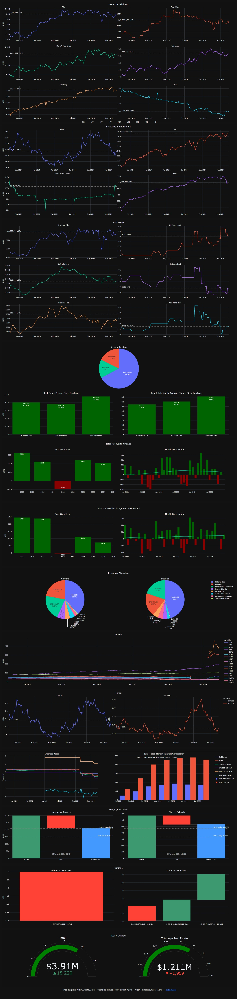

# Finance

This is a project to keep track of finances. It generates graphs like the following:



## How it works

Generally you will not be able to use this as is and it will need lots of modifications. This
is just to get you started.

It assumes all financial data is kept track of using [Ledger CLI](https://ledger-cli.org/).
See [this example ledger file](examples/ledger.ledger).

The `finance_hourly.py` script should be run hourly. This stores all the historical data and creates plots.
This could be run with a systemd timer:

```shell
docker compose up accounts_hourly --force-recreate --exit-code-from accounts_hourly
```

## Adding new indices

```shell
# For indices.
TICKER="^SSMI"
./add_ticker.py --ticker ^SPX
```

Update `balance_etfs.py` to include new ticker.
