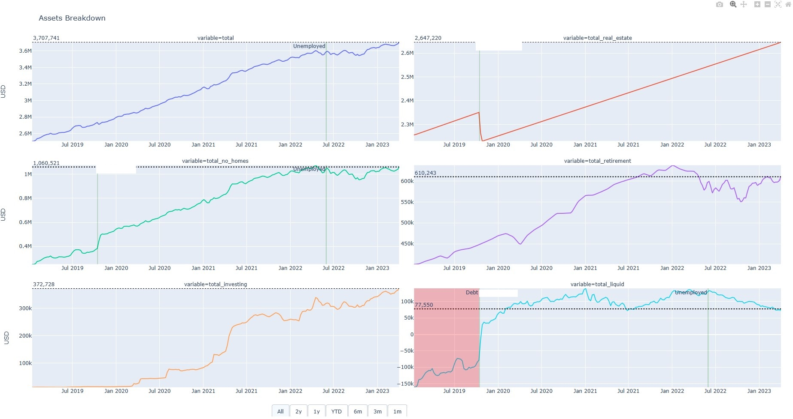
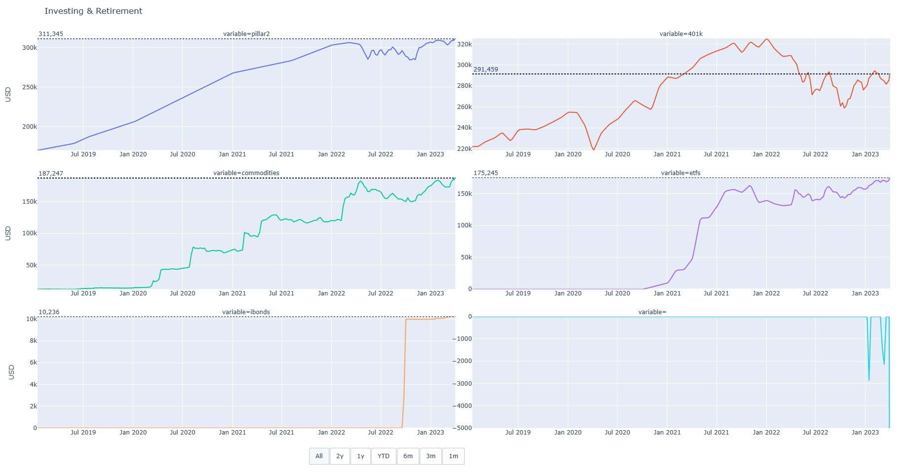
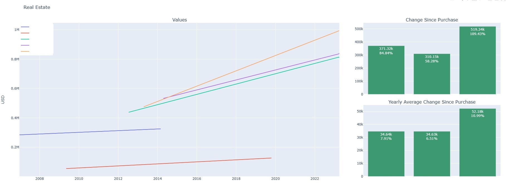
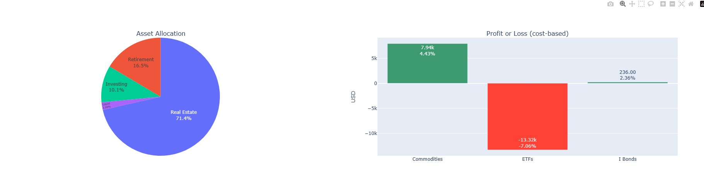
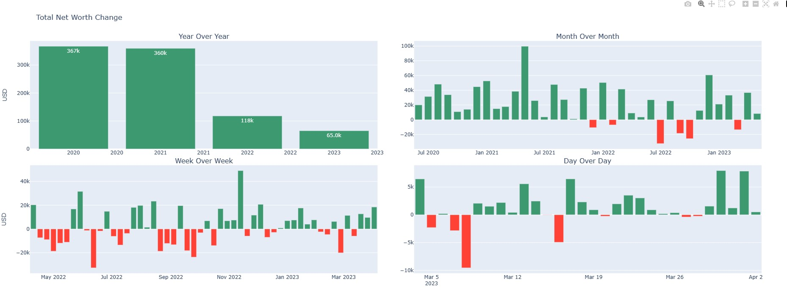
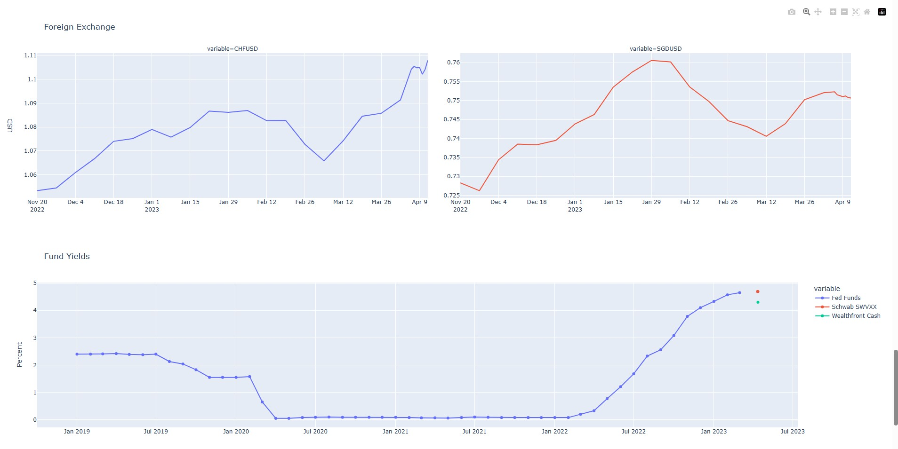

# Finance

This is a project to keep track of finances. It generates graphs like the following:








## How it works

Generally you will not be able to use this as is and it will need lots of modifications. This
is just to get you started.

The `finance_hourly.py` script should be run hourly. The `finance_daily.py` script should be run daily.
This stores all the historical data as text or CSV files, and then creates plots.

Crontab example:

```shell
@hourly             flock $HOME/code/accounts -c "$HOME/software/miniconda3/condabin/conda run -n investing $HOME/bin/accounts/finance_hourly.py"
@daily              flock $HOME/code/accounts -c "$HOME/software/miniconda3/condabin/conda run -n investing $HOME/bin/accounts/finance_daily.py"
```

Locking the directory is to prevent both scripts writing at the same time.

## Files

### add_account.py

Example script for adding an account and updating the accounts dataframe.

### authorization.py

Authorization secrets.

### balance_etfs.py

Does rebalancing of ETFS/tickers.

### commodities.py

Write commodity price history to a CSV file.

### common.py

Some common methods used throughout.

### conda.env.export

Conda package list showing requirements. Created with `conda env export > conda.env.export`.

### etfs.py

Write ETF/ticker values to a CSV file.

### fedfunds.py

Write fedfunds rate to a CSV file.

### finance_daily.py

Script that should run daily.

### finance_hourly.py

Script that should run hourly.

### history.py

Writes historical data to CSV files.

### homes.py

Get real estate prices from Redfin and Zillow.

### i_and_e.py

Generate income and expense plots.

### plot.py

Generate plots.

### relayout_example.py

Example script showing how to update X and Y axes based on a range selector.

### swvxx_yield.py

Get Charles Schwab SWVXX 7-day yield and store in a CSV file. Uses Selenium.

### wealthfront_cash_yield.py

Get Wealthfront Cash APY and store in a CSV file. Uses Selenium.
